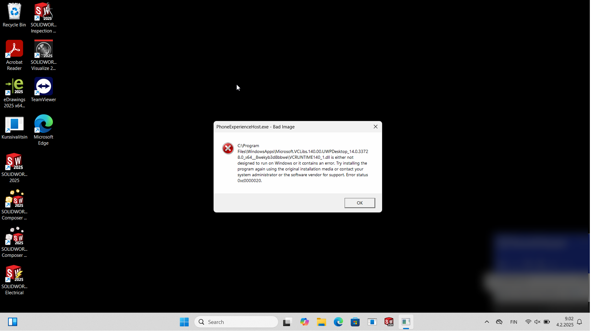

# vclibs-bad-image-fix

A script that guides the user to fix VcLibs "Bad Image" errors in Windows 11.

> **:warning: The script elevates itself to TrustedInstaller, which can be used to create serious damage to your system. Use with caution!**

## What?

After upgrading Windows 10 to 11 or just applying updates to Windows 11 from Windows update, you might sometimes be introduced to the following error screen:

This means that the underlying code that is required execute some default Windows applications appear to be corrupted. If you browse to the folder that is indicated in the error message, you find that the size of the files there are 0.

This script is built based on a guide provided by WinHelpOnline.

## Usage

1. Download the script
2. Right-click on the script -> Properties
3. Click on the "Unblock" field to allow the execution and click on "Apply" -> "OK"
4. Open Powershell and execute the following command:
   - `Set-ExecutionPolicy Unrestricted`
5. Reopen Powershell and run the script
